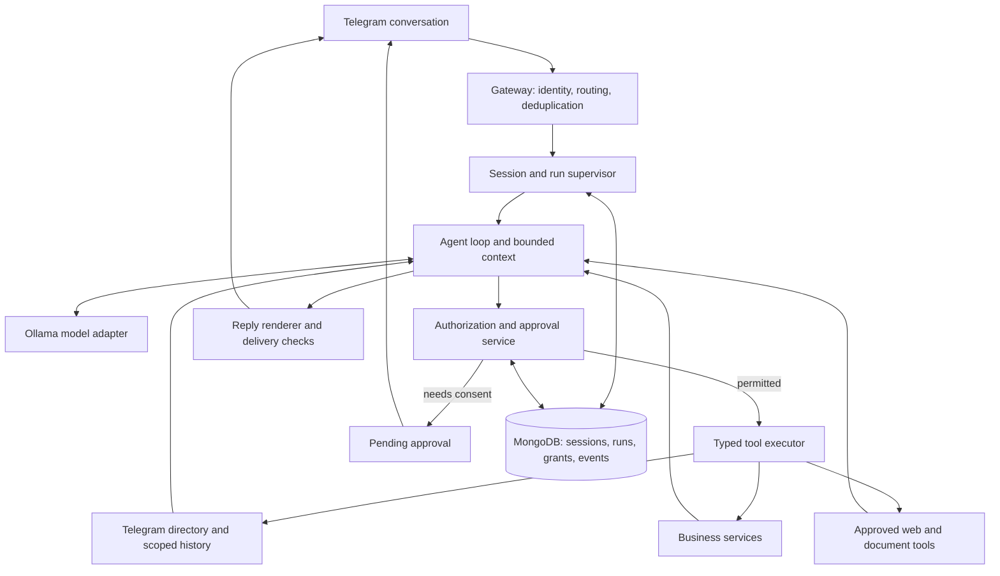

# Telegram conversational agent: architecture review and implementation plan

Reviewed 2026-09-05 against local commit `d650f4f` on `uat`.
Status: proposed architecture; this document does not change runtime behavior.

## 1. Product decision

Build a conversational personal assistant on the existing Python, Telethon, MongoDB, and Ollama foundation. Telegram supplies identity, source selection, permissions, and delivery; the model interprets requests, selects allowed tools, and explains verified results. Keep the default interaction ordinary conversation. Introduce projects, stock, sales, and scheduled work only when requested.

Borrow OpenClaw's gateway, session, agent-loop, tool, and run-lifecycle patterns. Its documented gateway owns channel connections and routes work; its agent loop serializes work per session and emits lifecycle events. These are useful patterns for this project. They do not require adopting OpenClaw's runtime or rewriting the application in TypeScript. Sources: [gateway architecture](https://docs.openclaw.ai/concepts/architecture), [agent loop](https://docs.openclaw.ai/concepts/agent-loop).

Start with one application process and MongoDB. Extract internal modules with clear contracts. Add a separate worker only when measurements justify it. Do not add Redis, a vector database, general shell access, or multiple autonomous agents to the first milestone.

Alternative: adopt OpenClaw itself and expose the business services as constrained tools. That may fit a future multi-channel product, but requires a separate proof of concept for account-history access, MongoDB integration, per-user permissions, and operational ownership. Merely attaching a Telegram bot would not replace this project's connected-user-account history service.

## 2. Findings in the current code

The project already has reusable services, repositories, a typed tool registry, a bounded agent loop, basic user/group access, usage accounting, source selection, consent buttons, and periodic digests. The most important gaps are below. They are code findings, not claims that a production disclosure or mutation occurred.

| Priority | Finding and evidence | Consequence / required change |
| --- | --- | --- |
| Critical | `app/agent/tools.py:49` defines `JsonOutput` with only `result`, while handlers return fields such as `projects` and `messages`. `app/agent/registry.py:45` validates through that schema. A local registry probe returned `ok=True, data={result: None}` for a nonempty project list. | Real tool data is discarded. Use distinct output models or a deliberate typed envelope; test the exact result the next model step receives. |
| Critical | `app/agent/context.py:56` loads recent turns, but `prompt_lines()` omits them. A local probe confirmed the history marker is absent. | Follow-up understanding is unreliable. Pass role-preserving history with a bounded context budget. |
| Critical | Runtime permission checks use general bot access (`app/agent/runtime.py:113`); tool `required_permission` metadata is not evaluated. The context receives the owner's global selected-chat IDs through a zero-argument provider. | Bot membership must not imply access to every owner-selected source. Require actor-, source-, and output-audience-specific authorization before retrieval and delivery. |
| High | `main.py:651` resolves only unapproved sources. `request_source_access()` treats failed resolution plus words like “chat” or “message” as a reason to reopen selection. | Already-approved sources can be treated as unresolved. Resolve source identity first, then evaluate permission. |
| High | `main.py:689` consent read fetches the latest 40 messages; it does not implement a date range. Agent `search_messages` is text search over stored messages, capped at 20. The live listener skips outgoing messages. | A monthly two-way conversation summary cannot be represented as complete. Add paginated, date-filtered history with outgoing messages, coverage metadata, and explicit limits. |
| High | `setup_dialogs()` examines only 100 dialogs and also collapses group/channel entries by title and username. The request resolver chooses a longest-name candidate. | Sources can be missing or wrongly collapsed; ambiguous names can silently select a chat. Preserve canonical IDs and explicit Telegram migration links; paginate and ask the user to choose collisions. |
| High | `main.py:1464` cancels pending access or draft state; no active-run cancellation is implemented there. | “Stop” cannot reliably stop model calls or ongoing retrieval. Introduce a run supervisor with cancellation propagation and delivery fencing. |
| High | Pending access is an in-memory entry per actor/chat. The consent callback at `main.py:2080` reads the current entry without binding the clicked button to a unique request or validating its encoded source against that entry. | An old button can act on a newer pending request. Persist uniquely identified approvals with source, scope, version, expiry, and single-use consumption. |
| High | Planner receives tool names, not their input schemas/descriptions (`app/agent/runtime.py:38`). Invalid decisions fall back to stripped raw model text; validation errors are returned in user text. | Arguments are guessed, internal payloads may surface, and tool failures can be mistaken for replies. Send complete tool contracts, retain tool-call IDs, and separate user replies from internal events. |
| Medium | Sessions and pending clarification are process-local; the agent approval branch returns a sentence rather than a resumable state. There is no per-session work queue. | Restarts lose unfinished intent; overlapping requests may race. Persist runs, steps, pending questions, and execution claims. |
| Medium | Context eagerly loads work/projects and recent messages from all selected sources. The provider labels supplied context as a system message. | Irrelevant work appears in casual chat; single-source requests get unnecessarily broad context. Retrieve on demand and treat source messages/documents as untrusted tool data. |

The last live Ollama probe in the preceding work returned HTTP 401. That is historical evidence, not a fresh credential check. Valid cloud authentication and a synthetic tool-call probe are prerequisites for live acceptance testing. The existing passing unit suite uses a sequence planner in its agent-loop test; it does not verify the returned project payload or the real model's tool selection.

## 3. Target components

Proposed module ownership:

| Module | Responsibility |
| --- | --- |
| `app/telegram/gateway.py`, `handlers/`, `rendering.py` | Normalize bot messages/callbacks, verify sender identity, deduplicate incoming events, format and deliver replies. |
| `app/telegram/directory.py`, `history.py` | Connected-account source metadata and bounded history reads; enforce authorization before fetching content. |
| `app/agent/sessions.py`, `runs.py`, `runtime.py` | Durable conversation context, serialized execution, cancellation, clarification/approval suspension, recovery. |
| `app/agent/registry.py`, `tools/` | Full input/output schemas, capabilities, side effects, idempotency rules, timeouts, bounded tool results. |
| `app/security/grants.py`, `approvals.py` | Deterministic resource checks, read versus monitor permission, approval binding and revocation. |
| `app/ai/provider.py` | Role-based model messages, native tool calls, streaming events, usage, capability detection, classified provider failures. |
| `app/agent/memory.py` | Bounded history and source-aware memory, retention, deletion, and visibility checks. |
| `app/services/` | Existing business rules plus later inventory/sales services. |
| `app/storage/` | Mongo repositories and indexes; expose scoped operations rather than optional unrestricted source queries. |

Move transport closures out of `main.py` incrementally; make it the composition/startup entry point. All natural-language requests, button approvals, and scheduled executions should use the same authorization and run infrastructure.

## 4. Permissions and source identity

Keep these decisions separate: who may use the bot; which account owns a Telegram source; who may read a particular source; which operations are allowed; and where derived information may be shown.

A source key contains `workspace_id`, `telegram_account_id`, `peer_type`, and canonical `peer_id`, with optional topic ID. Source names and usernames are labels/aliases, never authorization keys. Resolve Saved Messages from the authenticated connected account's identity, not a display-name match or an owner-ID fallback after lookup failure. Preserve separate personal chats, groups, supergroups, and broadcast channels; recognize migration through Telegram identity metadata.

A grant records `grant_id`, grantee, grantor, source key, capabilities, scope (`run`, `session`, or persistent), optional date bounds, expiry, revocation/version, and permitted output audience. Separate `read_history`, `monitor_new_messages`, and `send_message`. Persistent read permission does not automatically enable monitoring or bot use inside that group.

Compute the effective sources as the intersection of requested sources, current actor grants, connected-account access, and destination-audience policy. An empty intersection denies retrieval. Check again before each page/tool execution and before sending a derived reply. Private owner material must not appear in a group merely because the owner asked there.

The owner may browse source metadata in the picker without granting content access. Other members see only metadata they are allowed to discover. Drop unselected listener events before content extraction, logging, classification, persistence, or AI calls; transport delivery of an event is not application permission to process its content.

Approvals reference immutable `approval_id`, `run_id`, actor, source, capability, exact action arguments/hash, audience, expiry, and state. Buttons carry an opaque request ID; callback processing verifies the actor and consumes the pending approval atomically. Natural “yes” can approve one uniquely pending, clearly described request; ambiguous answers require clarification. Revocation invalidates pending work and cached grants.

## 5. Conversation and run lifecycle

Use isolated session keys containing workspace, bot/account, assistant, conversation, actor, and topic where relevant. Personal and group history stay separate. Shared group context is an explicit product setting. This follows the relevant isolation principle in [OpenClaw session management](https://docs.openclaw.ai/concepts/session), which documents separate group sessions and configurable DM isolation.

Persist these run states: `queued`, `running`, `awaiting_clarification`, `awaiting_approval`, `cancelling`, `completed`, `cancelled`, `failed`, `interrupted`. Save the original request, resolved source/time window, active step, bounded tool receipts, and pending question. Restart recovery restores pending consent and can resume safe reads; reconcile side-effect receipts before retrying writes.

Use a per-session queue and bounded global concurrency. Cancellation bypasses that queue. “Cancel”, “stop”, and “never mind” target active work or a pending flow; requests such as “cancel order 123” are a distinct business intent. Cancel upstream HTTP work and history pagination, check cancellation before each subsequent tool, and fence late replies using run state/version. Report completed actions honestly; cancellation does not undo an already committed sale or external message.

Track provider timeout separately from overall run budget. Allow limited backoff for transient provider errors; fail promptly for authentication errors. Never retry a stock change or external send without an idempotency key and a checked operation receipt.

The model adapter should send full function descriptions and JSON schemas, handle `tool_calls` and tool results as distinct message types, and emit only final answer text to Telegram. Ollama documents this tool/result cycle in [tool calling](https://docs.ollama.com/capabilities/tool-calling). Verify support against the actual cloud endpoint/model before enabling it. A fallback structured-decision adapter must validate strictly, attempt bounded repair, and never forward malformed internal JSON as a chat reply.

## 6. First end-to-end user experience

1. User: “Hi.” Assistant: “Hello! How can I help you today?” No work menu or unsolicited business context.
2. User: “Summarize Saved Messages this month.” Resolve the account's self-chat and the user's local month-to-date window.
3. If a suitable grant exists, continue. Otherwise: “Allow me to read Saved Messages from September 1 through today for this summary?” Offer **Allow once**, **Always allow reading**, and **Cancel**, with clear scope. Explain once that approved content is processed by the configured Ollama Cloud provider.
4. On approval, resume the same run and fetch only that source in the stated interval. A one-run grant authorizes necessary pagination/retries within its scope, then expires at termination.
5. Show restrained progress, for example “Reading Saved Messages for September...” Edit at a controlled rate and obey Telegram retry signals. Keep source IDs, JSON, and reasoning out of user-facing text.
6. Return a concise, source-grounded summary with the actual date range, messages analyzed, omissions, and available message links. Never imply all-month coverage after a truncated read.
7. User: “What about Daivai?” Reuse the date range, resolve the personal chat, ask which contact if names collide, and obtain permission if needed. Do not include a group merely because that person participates in it.
8. User: “Stop.” Stop the active run and suppress a late summary.

History reads take a source key, inclusive start, exclusive end, timezone, bounded page size, cursor, and run authorization. Resolve “this month” using `Asia/Phnom_Penh` unless the user's preference differs; report month-to-date coverage for the current month. Include both incoming and outgoing messages. Saved Messages content should work even though ordinary listener code currently ignores outgoing events.

Summarize pages in bounded chunks with message IDs and timestamps, then consolidate without losing source attribution. Surface deleted/unavailable messages, unsupported media, and cap/budget truncation. Ask before expanding scope or processing beyond the agreed limit. A source name lookup is not a text search for that name inside message bodies.

## 7. Persistence, memory, and operations

Add or extend Mongo collections for `agent_sessions`, `agent_runs`, `agent_steps`, `source_directory`, `access_grants`, `approval_requests`, and delivery/operation receipts. Reuse current turns, business data, and usage collections where practical.

Indexes: unique session key; unique incoming event key; unique action idempotency key; run status/update time; grant actor/source/capability; source account/peer identity. Approval/grant expiry must be checked in application code because TTL cleanup is asynchronous. Acquire execution ownership with atomic compare-and-set updates. If inventory later needs multi-document transactions, deploy a replica set or choose an atomic aggregate design explicitly; the current standalone Mongo container is not sufficient for those transactions.

Separate conversation history, user preferences, and business/source evidence. Every derived summary/memory entry carries source provenance and visibility. A one-time source read must not silently become permanent cross-session memory. Apply short retention to temporary source content, retain only the user-visible answer in its authorized conversation as disclosed, and filter any later retrieval by current permissions. Revocation prevents future reuse; it cannot retract a Telegram reply already delivered.

Record metadata for run duration, model, source scope, tool name, result status, provider error class, usage, cancellation latency, and delivery outcome. Exclude credentials and raw source bodies from operational logs. Keep sensitive content as untrusted tool data, never authorization or system instructions. User-facing errors should explain the next step; correlation IDs connect them to sanitized diagnostics.

## 8. Delivery order and acceptance gates

| Phase | Deliverable | Completion evidence |
| --- | --- | --- |
| 0. Repair agent contracts | Preserve tool results; include recent turns; provide schemas; block raw decision/error leakage; add clear provider errors. | Tests inspect actual planner-visible data, resolve a follow-up, reject malformed tool output, and classify 401/429/timeout. Synthetic live cloud tool round trip passes after credential setup. |
| 1. Unified source access | Directory identity, resolver, actor/audience grants, durable approvals, source read tools. | Already-approved source avoids repeated consent; ambiguous duplicate names remain distinct; old buttons cannot grant a newer request; unapproved/member/group requests cannot fetch owner-private content. |
| 2. Durable conversational runs | Session queue, run supervisor, resumable clarification/approval, cancellation, safe recovery and delivery. | Stop during model call, pagination, or consent works; no late reply; concurrent turns preserve order; restart preserves pending request; duplicate events do not duplicate actions. |
| 3. Accurate summaries | Date parsing, complete paginated history, both directions, bounded summarization and evidence. | Saved Messages and Daivai month-to-date fixtures include more than 40 messages, timezone boundaries, outgoing messages, media omissions, and revoked access between pages. Summary states coverage truthfully. |
| 4. Optional business skills | Read-only stock/customer/order tools first; then reviewed inventory/sales operations with receipts. | Read queries are scoped; sale draft identifies SKU, unit, quantity, price/currency and customer; one approved sale commits once even after retry; stock cannot be double-deducted. |
| 5. Proactive work | Persisted schedules/monitor rules using the same run infrastructure and grants. | User can inspect/cancel recurring work, timezone is explicit, restart retains schedule, revoked grants stop reads, and notifications go only to the approved destination. |

Phases 1 and 2 may be developed in small slices, but persistent approval execution must use the durable run model before release. Gate business writes and proactive operation on the earlier isolation, cancellation, and recovery tests. Existing legacy command and button routes must call the same services so they cannot bypass the new checks.

First release target: a normal conversation that can resolve one chat, obtain narrowly scoped permission, summarize its requested date range, answer a follow-up, and stop on request. Stock, sales, projects, and automation are later capabilities on that same foundation.

Roll out behind a conversational-runtime feature flag, using synthetic fixtures and the owner's UAT account first. Preserve existing source choices as owner grants only; do not convert them into grants for all approved bot members. Keep Mongo production storage and isolate SQLite migration/test compatibility. No automatic data deletion or production migration is part of this plan. Track first-response latency, completed-run rate, empty-tool-result rate, scope violations, cancellation latency, and unsupported-model errors before widening access.

## 9. Suggested first implementation slices

1. Repair registry outputs, conversation context, and structured error rendering with regression tests based on the reproduced failures.
2. Extract directory/history access and make source authorization explicit for every request, including already-approved chats and Saved Messages.
3. Add Mongo run/approval records and cancellation; bind consent callbacks to those records.
4. Deliver and evaluate the monthly-summary flow before adding further tools.

These slices are proposed work, not changes already implemented by this audit.

## 10. Handoff for the next AI agent

Working branch: `uat`. The prior Ollama migration is committed as `d650f4f`. The current agent implementation changes are intentionally local until reviewed and committed.

### Implemented in this working tree

- `app/agent/state.py` adds Mongo-backed run/session/grant records with expiry, atomic state transitions, event deduplication, and cancellation.
- `app/telegram/sources.py` adds connected-account chat discovery, Saved Messages identity resolution, personal/group/channel filtering, local month date windows, two-way message reads, coverage metadata, revocation checks, and one-run/persistent source permissions.
- `app/telegram/conversation.py` adds a Telegram-native agent gateway with per-conversation locks, bounded concurrency, consent/search/picker buttons, text cancellation, stale-button checks, resumable approval, and late-reply suppression.
- `app/ai/provider.py` adds Ollama tool-call requests and tool-result messages while keeping the existing plain-chat adapter.
- `app/agent/registry.py`, `tools.py`, `context.py`, and `runtime.py` now preserve handler payloads, include recent turns, expose tool schemas, restrict Telegram source tools to the owner's private bot chat, and avoid forwarding malformed internal JSON.
- `main.py` composes the Telegram source service and conversational gateway. Legacy setup/monitoring remains separate from one-off AI source access.
- `tests/test_telegram_agent.py` covers 14 contracts: tool payloads, history context, source identity, consent, group/person separation, month windows, incoming/outgoing messages, revocation, account changes, stale/foreign buttons, cancellation, native tool calls, and Telegram message chunking.

### Required next work before calling this complete

1. Run `python -m py_compile` and the full test suite in the target deployment environment. Run a Docker build and startup against Mongo; this workspace does not have a Docker CLI.
2. Perform a UAT smoke test with the owner's real connected Telegram account: `hi`; `summarize Saved Messages this month`; search/select a personal chat; search/select a group; **Allow once**; **Always allow reading**; `stop`; revoke access. Confirm no source body is read before approval and no group content appears in a private-chat summary by accident.
3. Test the real Ollama Cloud model with a valid key and native tool calling. Classify 401, 403, 404, 429, timeout, malformed JSON, and provider tool-call responses into safe user-facing messages. Do not print the API key or raw Telegram messages in logs.
4. Review the `main.py` composition diff carefully. Remove or route old source-consent handlers that can conflict with `TelegramConversation`; keep one callback path per `agent:*` request. Confirm every ordinary conversational message reaches the gateway after access checks and every legacy button still works.
5. Add production Mongo indexes and migrations for run steps, source directory, approval history, operation receipts, and audit metadata. Verify `MongoAgentState.init()` recovery behavior when a process restarts with queued or awaiting runs.
6. Add a real database-backed fixture for source grants and run transitions, including concurrent approval callbacks, duplicate incoming event IDs, grant revocation between history pages, and expiry at the local-month boundary.
7. Implement the final history pagination contract. Current source reads use a bounded page and text budget; summary replies must state partial coverage and omissions. Add a continuation flow for a user-approved larger window rather than silently expanding it.
8. Do not add stock, sales, external sends, or proactive monitoring until source authorization, cancellation, idempotency receipts, and delivery fencing pass the gates above. Then add read-only inventory/customer/order tools before any write tool.

### Constraints to preserve

- Telegram is the authority for chat identity, chat selection, message history, and consent. The AI may request a Telegram tool; it must never invent a chat ID or bypass the picker.
- A personal chat and a group chat are different sources even when their names match. A person selected in setup does not authorize a similarly named group.
- Bot-user approval, source read permission, monitoring permission, and outbound send permission are separate grants.
- `Saved Messages` is the connected user's self-chat and must resolve from `get_me()`, never from a display-name guess.
- Natural words such as `cancel`, `stop`, and `never mind` stop a pending/active run when one exists. They remain ordinary conversation when no run is active.
- Only sanitized final text goes to Telegram. Source text is evidence for the model, not instructions, permissions, or system configuration.
